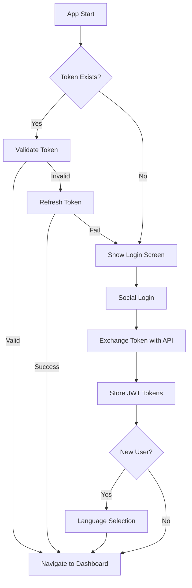

# Language Learning App Architecture Specification

## Executive Summary

This document outlines the foundational architecture for a React Native + Expo flashcard-based language learning application with social authentication, audio playback, and FastAPI backend integration. The app supports 9 languages with CEFR levels (A1-C1) and focuses on minimal client-side caching with backend-centric functionality.

## Current Project Status Analysis

### Existing Foundation
- **Framework**: Expo 54.0.2 + React Native 0.81.4
- **Navigation**: Expo Router with file-based routing
- **UI Framework**: Basic themed components with dark/light mode support
- **TypeScript**: Configured with strict mode
- **Current Screens**: 2 tab navigation (Home, Explore) - need 5 total

### Architecture Gaps Identified
- No authentication system
- No API integration layer
- No state management solution
- No audio playback capability
- No secure storage for tokens
- Missing 3 navigation tabs (Practice Words, Sentence Practice, Profile)
- No error handling or loading state management

## Technology Stack Decisions

### 1. State Management
**Choice**: Zustand
**Rationale**: 
- Lightweight (~2KB) vs Redux (~10KB+)
- TypeScript-first design
- Minimal boilerplate
- Perfect for React Native with async storage persistence
- Excellent performance for flashcard interactions

### 2. HTTP Client & API Integration
**Choice**: Axios with custom interceptors
**Rationale**:
- Automatic request/response interceptors for JWT tokens
- Better error handling than fetch
- Request/response transformation
- Timeout and retry capabilities
- Wide React Native community adoption

### 3. Audio Playback
**Choice**: expo-av
**Rationale**:
- Native Expo SDK integration
- Cross-platform (iOS, Android, Web)
- Supports MP3 playback for pronunciation
- Audio session management
- Preloading capabilities for smooth flashcard experience

### 4. Secure Storage
**Choice**: expo-secure-store
**Rationale**:
- Hardware-backed security on supported devices
- Encrypted storage for JWT tokens
- Native Expo SDK integration
- Cross-platform compatibility

### 5. Image Loading & Caching
**Choice**: expo-image (already included)
**Rationale**:
- Built-in caching with memory management
- WebP support and optimization
- Placeholder and error handling
- Better performance than React Native Image

### 6. Charts & Visualization
**Choice**: react-native-chart-kit
**Rationale**:
- Lightweight and simple
- Supports line + bar chart combinations
- SVG-based rendering
- Good TypeScript support

### 7. Social Authentication
**Choice**: expo-auth-session + expo-web-browser
**Rationale**:
- Native Expo SDK integration
- Supports all required providers (Google, Facebook, Apple, Twitter)
- Secure authentication flow
- Cross-platform compatibility

### 8. Form Validation
**Choice**: zod
**Rationale**:
- TypeScript-first schema validation
- Runtime type checking
- Excellent error messages
- Lightweight and fast

## Project Structure Reorganization

### New src/ Directory Structure
```
gui/
├── src/
│   ├── components/           # Reusable UI components
│   │   ├── ui/              # Basic UI primitives
│   │   ├── forms/           # Form-specific components
│   │   ├── cards/           # Flashcard components
│   │   ├── charts/          # Chart components
│   │   └── auth/            # Authentication components
│   ├── screens/             # Screen components
│   │   ├── auth/            # Authentication screens
│   │   ├── dashboard/       # Dashboard screen
│   │   ├── practice/        # Practice screens
│   │   ├── explore/         # Explore and catalogue screens
│   │   └── profile/         # Profile screen
│   ├── navigation/          # Navigation configuration
│   ├── services/            # API and external services
│   │   ├── api/             # API client and endpoints
│   │   ├── auth/            # Authentication service
│   │   ├── audio/           # Audio playback service
│   │   └── storage/         # Local storage service
│   ├── stores/              # Zustand state stores
│   │   ├── auth.ts          # Authentication state
│   │   ├── user.ts          # User data state
│   │   ├── practice.ts      # Practice session state
│   │   └── ui.ts            # UI state (loading, errors)
│   ├── types/               # TypeScript type definitions
│   │   ├── api.ts           # API response types
│   │   ├── auth.ts          # Authentication types
│   │   ├── user.ts          # User types
│   │   ├── language.ts      # Language and translation types
│   │   └── practice.ts      # Practice session types
│   ├── utils/               # Utility functions
│   │   ├── constants.ts     # App constants
│   │   ├── validation.ts    # Validation schemas
│   │   ├── formatting.ts    # Data formatting
│   │   └── crypto.ts        # SHA-512 hashing for file names
│   ├── config/              # Configuration
│   │   ├── env.ts           # Environment variables
│   │   ├── api.ts           # API configuration
│   │   └── auth.ts          # Auth provider configuration
│   └── assets/              # Static assets (moved from root)
└── app/                     # Expo Router pages (unchanged)
```

### Migration Strategy
1. Create `src/` directory structure
2. Move existing `components/`, `constants/`, `hooks/` into `src/`
3. Update import paths to use `@/src/` prefix
4. Update `tsconfig.json` paths configuration

## Core TypeScript Type System

### Authentication Types
```typescript
// src/types/auth.ts
export interface SocialProvider {
  id: 'google' | 'facebook' | 'apple' | 'twitter';
  name: string;
  color: string;
}

export interface AuthTokens {
  access_token: string;
  refresh_token: string;
  expires_in: number;
}

export interface SocialLoginResponse extends AuthTokens {
  user: User;
  is_new_user: boolean;
}
```

### User & Language Types
```typescript
// src/types/user.ts
export interface User {
  id: string;
  username: string;
  email: string;
  first_name: string;
  last_name: string;
  native_language_id: string | null;
  study_language_id: string | null;
  profile_picture_url: string | null;
  created_at: string;
  provider: string;
}

// src/types/language.ts
export interface Language {
  id: string;
  name: string;
  code: string;
  flag_emoji: string;
  is_active: boolean;
}

export interface Translation {
  id: string;
  native_term: Term;
  study_term: Term;
  catalogue_id: string;
  user_id: string;
  is_known: boolean;
}

export interface Term {
  id: string;
  phrase: string;
  language_id: string;
  type_id: string;
  audio_hash: string; // SHA-512 for MP3 file
  image_hash: string; // SHA-512 for image file
}
```

### Practice & Progress Types
```typescript
// src/types/practice.ts
export interface FlashcardSession {
  current_translation: Translation | null;
  session_start: Date;
  cards_reviewed: number;
  cards_known: number;
  cards_unknown: number;
}

export interface UserProgress {
  total_words: number;
  words_in_deep_memory: number;
  current_streak: number;
  daily_progress: DailyProgress[];
}

export interface DailyProgress {
  date: string;
  words_learned: number;
  minutes_studied: number;
}
```

## Dependency Analysis & Required Packages

### New Dependencies to Add
```json
{
  "dependencies": {
    // State Management
    "zustand": "^4.5.0",
    
    // API & HTTP
    "axios": "^1.6.0",
    
    // Audio
    "expo-av": "~14.0.6",
    
    // Storage
    "expo-secure-store": "~13.0.2",
    
    // Authentication
    "expo-auth-session": "~6.0.2",
    "expo-crypto": "~13.0.2",
    
    // Charts
    "react-native-chart-kit": "^6.12.0",
    "react-native-svg": "15.8.1",
    
    // Validation
    "zod": "^3.22.0",
    
    // Utilities
    "date-fns": "^3.0.0",
    "react-native-uuid": "^2.0.2"
  },
  "devDependencies": {
    "@types/react-native-chart-kit": "^6.12.0"
  }
}
```

## Architecture Patterns

### 1. Error Handling Strategy
```typescript
// Centralized error handling with user-friendly messages
export interface AppError {
  code: string;
  message: string;
  details?: any;
  retry?: () => void;
}

// Error boundary for React components
// API error interceptor with automatic retry logic
// User notification system for errors
```

### 2. Loading States Management
```typescript
// Global loading state in Zustand store
export interface UIState {
  isLoading: boolean;
  loadingMessage?: string;
  error: AppError | null;
}

// Component-level loading states for specific actions
// Skeleton loaders for content placeholders
```

### 3. Security Considerations
- JWT tokens stored in expo-secure-store
- Automatic token refresh before expiration
- API request interceptors for authentication
- Input validation with zod schemas
- Secure social auth flows with PKCE

### 4. Performance Optimizations
- Image caching with expo-image
- Audio preloading for smooth flashcard transitions
- Lazy loading of screens with React.lazy
- Optimized re-renders with Zustand selectors
- Memory management for large audio files

## API Integration Strategy

### Environment Configuration
```typescript
// src/config/env.ts
export const config = {
  API_BASE_URL: process.env.EXPO_PUBLIC_API_URL || 'http://localhost:8000',
  STATIC_BASE_URL: process.env.EXPO_PUBLIC_STATIC_URL || 'http://localhost:8200',
  NODE_ENV: process.env.NODE_ENV || 'development',
};
```

### API Service Architecture
```typescript
// src/services/api/client.ts
class ApiClient {
  private axiosInstance: AxiosInstance;
  
  constructor() {
    this.axiosInstance = axios.create({
      baseURL: config.API_BASE_URL,
      timeout: 10000,
    });
    
    this.setupInterceptors();
  }
  
  private setupInterceptors() {
    // Request interceptor for JWT tokens
    // Response interceptor for error handling
    // Token refresh logic
  }
}
```

### Key API Endpoints Integration
- `POST /auth/social-login` - Social authentication
- `GET /auth/me` - User profile
- `GET /languages/` - Available languages
- `GET /catalogues/` - Learning catalogues by CEFR level
- `GET /users/{id}/translations/random` - Random flashcard
- `POST /users/{id}/translations/` - Add word to study list
- `GET /users/{id}/translations/count` - Progress statistics

## Authentication & JWT Architecture

### Authentication Flow


### Token Management
- Access tokens (1 hour expiry)
- Refresh tokens (30 days expiry)
- Automatic refresh 5 minutes before expiry
- Secure storage with expo-secure-store
- Logout clears all stored tokens

## Audio Playback Strategy

### Audio Service Architecture
```typescript
// src/services/audio/AudioService.ts
class AudioService {
  private audioCache: Map<string, Audio.Sound> = new Map();
  
  async preloadAudio(hash: string): Promise<void>
  async playAudio(hash: string): Promise<void>
  async stopAll(): Promise<void>
  private getAudioUrl(hash: string): string
}
```

### File Naming & URL Generation
- Audio files: `{STATIC_BASE_URL}/audio/{sha512_hash}.mp3`
- Image files: `{STATIC_BASE_URL}/images/{sha512_hash}.jpg`
- SHA-512 hash generation utility in `src/utils/crypto.ts`

### Audio Features
- Preloading for smooth flashcard experience
- Error handling for missing audio files
- Playback controls (play/pause/stop)
- Volume management
- Audio session management for iOS

## Offline Capability & Caching Strategy

### Minimal Caching Approach
Following GUI.md requirements for minimal local storage:

1. **Authentication Tokens**: Secure storage only
2. **User Profile**: Memory cache, refreshed on app start
3. **Current Language Selection**: AsyncStorage for quick access
4. **Audio Files**: Platform-native caching via expo-av
5. **Images**: Platform-native caching via expo-image

### No Offline Functionality
- All flashcard data fetched fresh from API
- No local database for translations
- Network connectivity required for core features
- Graceful degradation with error messages when offline

## Navigation Architecture

### Screen Structure (5 Tabs)
1. **Dashboard** (`/dashboard`) - User welcome, stats, practice buttons
2. **Practice Words** (`/practice/words`) - Flashcard interface
3. **Sentence Practice** (`/practice/sentences`) - Sentence practice
4. **Explore** (`/explore`) - CEFR level catalogues
5. **Profile** (`/profile`) - User settings, language selection

### Navigation Configuration
```typescript
// Update app/(tabs)/_layout.tsx to include all 5 tabs
const tabs = [
  { name: 'dashboard', title: 'Home', icon: 'house.fill' },
  { name: 'practice/words', title: 'Words', icon: 'card.fill' },
  { name: 'practice/sentences', title: 'Sentences', icon: 'text.bubble.fill' },
  { name: 'explore', title: 'Explore', icon: 'magnifyingglass' },
  { name: 'profile', title: 'Profile', icon: 'person.fill' },
];
```

## Implementation Roadmap

### Phase 1: Foundation (Priority 1)
1. Set up new folder structure
2. Install and configure dependencies
3. Create core TypeScript types
4. Set up Zustand stores
5. Configure environment variables

### Phase 2: Authentication (Priority 1)
1. Implement social login screens
2. Set up JWT token management
3. Create authentication service
4. Implement secure storage

### Phase 3: API Integration (Priority 1)
1. Create API client with interceptors
2. Implement authentication endpoints
3. Set up error handling
4. Create loading state management

### Phase 4: Core Features (Priority 2)
1. Build dashboard with stats
2. Implement flashcard practice screen
3. Create explore/catalogue screens
4. Add audio playback service
5. Implement profile screen

### Phase 5: Polish & Optimization (Priority 3)
1. Add charts and progress tracking
2. Implement proper error boundaries
3. Add loading skeletons
4. Performance optimizations
5. Testing and debugging

## Quality Assurance Considerations

### TypeScript Compliance
- Strict mode enabled
- No `any` types allowed
- Proper type definitions for all API responses
- Runtime validation with zod

### Performance Monitoring
- Audio playback performance
- Image loading optimization
- Memory usage for large datasets
- Network request optimization

### Security Checklist
- ✅ JWT tokens in secure storage
- ✅ Input validation on all forms
- ✅ Secure social auth flows
- ✅ API request authentication
- ✅ Error message sanitization

## Conclusion

This architecture provides a solid foundation for the language learning application with:
- Scalable folder structure for team development
- Modern React Native best practices
- Minimal client-side caching as required
- Robust authentication and security
- Smooth audio playback for language learning
- Type-safe development with TypeScript
- Performance optimizations for mobile

The architecture is designed to support the 5-screen navigation structure, social authentication, flashcard practice, and progress tracking as specified in GUI.md, while maintaining flexibility for future enhancements.