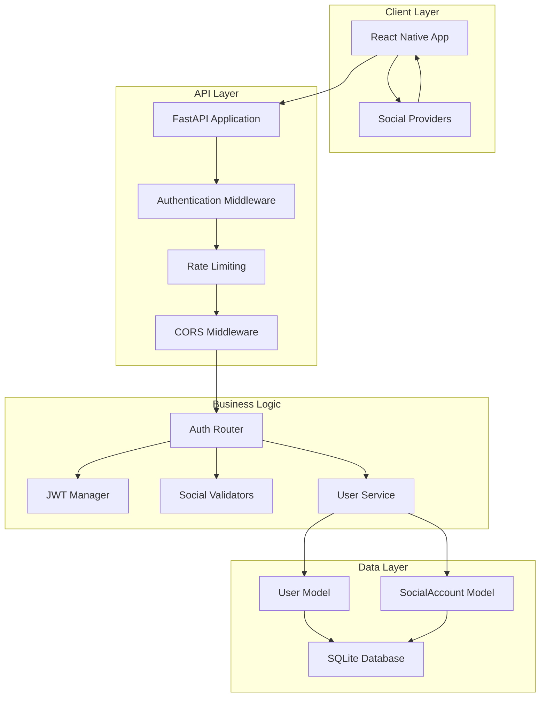
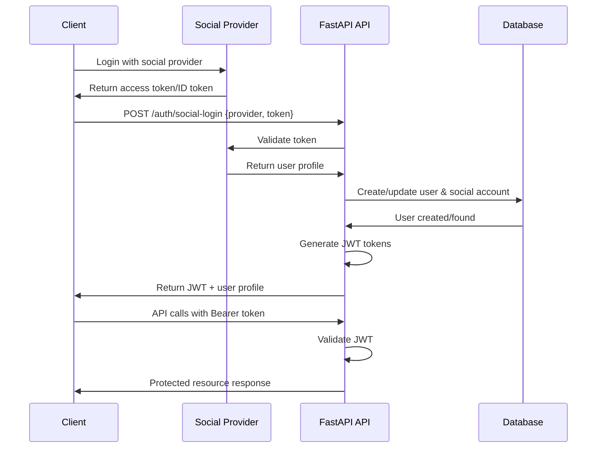

# JWT Authentication Architecture Recommendations

## Executive Summary

Based on comprehensive research and analysis of your FastAPI language learning API, I recommend implementing a **social-only authentication system** using JWT tokens. This approach aligns with modern mobile app practices, reduces security complexity, and provides excellent user experience.

### Key Recommendations

1. **Authentication Method**: Social login only (Google, Facebook, Apple, X/Twitter)
2. **JWT Library**: PyJWT (as used in FastAPI documentation)
3. **Token Strategy**: Short-lived access tokens (1 hour) with refresh tokens (30 days)
4. **User Model**: Enhanced with social account linking and authentication metadata
5. **Security**: Comprehensive security middleware, rate limiting, and structured logging

## Technology Stack Recommendations

### Core Dependencies
```python
# Add to requirements.txt
pyjwt==2.8.0                    # JWT token handling
passlib[bcrypt]==1.7.4          # Password hashing (for future use)
pydantic-settings==2.1.0        # Environment configuration
python-multipart==0.0.6         # Already included - form data
httpx==0.26.0                   # Already included - HTTP client for social validation
```

### Library Rationale

| Library | Choice | Rationale |
|---------|--------|-----------|
| **JWT** | PyJWT | Official FastAPI docs use it, simpler API, well-maintained |
| **Password Hashing** | passlib[bcrypt] | Industry standard, future-proof if password auth needed |
| **Settings** | pydantic-settings | Type-safe configuration, environment variable support |
| **HTTP Client** | httpx | Already in use, async support for social provider validation |

## Architecture Overview

### System Architecture



### Authentication Flow



## Recommended File Structure

### New File Organization
```
api/
├── auth/                          # NEW: Authentication module
│   ├── __init__.py
│   ├── dependencies.py            # Auth dependencies
│   ├── jwt_manager.py             # JWT token management
│   ├── social_validators.py       # Social provider validation
│   └── exceptions.py              # Auth-related exceptions
├── core/                          # ENHANCED: Core utilities
│   ├── __init__.py
│   ├── config.py                  # Environment configuration
│   ├── security.py                # Security utilities
│   └── logging.py                 # Logging configuration
├── middleware/                    # NEW: Custom middleware
│   ├── __init__.py
│   ├── rate_limiting.py
│   ├── security_headers.py
│   └── logging_middleware.py
├── models/                        # ENHANCED: Existing models
│   ├── user.py                    # Enhanced with auth fields
│   └── social_account.py          # NEW: Social account model
├── routes/                        # ENHANCED: Existing routes
│   ├── auth.py                    # NEW: Authentication routes
│   └── [existing route files]     # Protected with auth
├── services/                      # NEW: Business logic layer
│   ├── __init__.py
│   ├── user_service.py
│   └── auth_service.py
└── utils/                         # NEW: Utility functions
    ├── __init__.py
    └── validators.py
```

## Database Schema Changes

### User Table Modifications
```sql
-- Add new columns to existing users table
ALTER TABLE users ADD COLUMN is_active BOOLEAN DEFAULT true;
ALTER TABLE users ADD COLUMN email_verified BOOLEAN DEFAULT true;
ALTER TABLE users ADD COLUMN profile_picture_url TEXT;
ALTER TABLE users ADD COLUMN created_at TIMESTAMP DEFAULT CURRENT_TIMESTAMP;
ALTER TABLE users ADD COLUMN last_login TIMESTAMP;

-- Create indexes for performance
CREATE INDEX idx_users_is_active ON users(is_active);
CREATE INDEX idx_users_email ON users(email);
CREATE INDEX idx_users_last_login ON users(last_login);
```

### Social Accounts Table
```sql
-- Create new social_accounts table
CREATE TABLE social_accounts (
    id UUID PRIMARY KEY DEFAULT gen_random_uuid(),
    user_id UUID NOT NULL REFERENCES users(id) ON DELETE CASCADE,
    provider VARCHAR(50) NOT NULL,
    provider_user_id VARCHAR(255) NOT NULL,
    provider_email VARCHAR(255),
    provider_username VARCHAR(255),
    provider_name VARCHAR(255),
    raw_data TEXT,
    created_at TIMESTAMP DEFAULT CURRENT_TIMESTAMP,
    updated_at TIMESTAMP DEFAULT CURRENT_TIMESTAMP,
    
    CONSTRAINT unique_provider_user UNIQUE(provider, provider_user_id)
);

-- Create indexes for social accounts
CREATE INDEX idx_social_accounts_user_id ON social_accounts(user_id);
CREATE INDEX idx_social_accounts_provider ON social_accounts(provider);
CREATE INDEX idx_social_accounts_provider_email ON social_accounts(provider_email);
```

### Migration Strategy
1. **Phase 1**: Add new columns to users table with default values
2. **Phase 2**: Create social_accounts table
3. **Phase 3**: Backfill existing users with `is_active=true`, `email_verified=true`
4. **Phase 4**: Update application code to use new authentication system

## Security Implementation

### Security Layers

| Layer | Implementation | Purpose |
|-------|---------------|---------|
| **Transport** | HTTPS/TLS | Encrypt data in transit |
| **Authentication** | JWT with social login | Verify user identity |
| **Authorization** | Role-based access (future) | Control resource access |
| **Rate Limiting** | Per-IP request limits | Prevent abuse |
| **Input Validation** | Pydantic models | Sanitize inputs |
| **Logging** | Structured security logs | Monitor threats |
| **Headers** | Security headers middleware | Prevent common attacks |

### JWT Security Configuration
```python
# Recommended JWT settings
JWT_SECRET_KEY = "256-bit-cryptographically-secure-random-key"
JWT_ALGORITHM = "HS256"
ACCESS_TOKEN_EXPIRE_MINUTES = 60      # 1 hour
REFRESH_TOKEN_EXPIRE_DAYS = 30        # 30 days
```

### Social Provider Security
- **Token Validation**: Always validate tokens with provider APIs
- **Scope Limitation**: Request minimal required scopes
- **Error Handling**: Don't expose internal errors to clients
- **Rate Limiting**: Apply to social login endpoints

## Performance Considerations

### Token Performance
- **JWT Size**: Keep payload minimal (~200-500 bytes)
- **Validation Speed**: In-memory validation (no DB lookup for basic auth)
- **Caching**: Consider Redis for token blacklisting if needed

### Database Performance
- **Indexes**: Proper indexing on user lookup fields
- **Connection Pooling**: Configure for expected load
- **Query Optimization**: Use select specific fields, not `SELECT *`

### API Performance
- **Async Operations**: Use async for all I/O operations
- **Background Tasks**: Use FastAPI BackgroundTasks for non-critical operations
- **Response Size**: Paginate large responses

## Route Protection Strategy

### Implementation Approach
```python
# Apply authentication to all existing routes
from auth.dependencies import auth_deps

# Example: Protect existing user routes
@router.get("/", response_model=List[UserPublic])
async def read_users(
    session: SessionDep,
    current_user: User = Depends(auth_deps.require_active_user()),  # NEW
    skip: int = 0,
    limit: int = 100
):
    """Get all users - now requires authentication"""
    users = session.exec(select(User).offset(skip).limit(limit)).all()
    return users
```

### Batch Protection Process
1. **Phase 1**: Add authentication to critical routes (user management, translations)
2. **Phase 2**: Add authentication to all remaining routes
3. **Phase 3**: Add role-based authorization (future enhancement)

## Configuration Management

### Environment Variables
```bash
# Required Environment Variables
JWT_SECRET_KEY=your-256-bit-secret-key
GOOGLE_CLIENT_ID=your-google-client-id
FACEBOOK_APP_ID=your-facebook-app-id
APPLE_CLIENT_ID=your-apple-client-id
TWITTER_CLIENT_ID=your-twitter-client-id

# Optional with defaults
JWT_ACCESS_TOKEN_EXPIRE_MINUTES=60
JWT_REFRESH_TOKEN_EXPIRE_DAYS=30
RATE_LIMIT_PER_MINUTE=60
LOG_LEVEL=info
```

### Configuration Validation
- **Startup Checks**: Validate all required settings on startup
- **Secret Strength**: Ensure JWT secret is cryptographically secure
- **Environment Awareness**: Different configs for dev/staging/production

## Testing Strategy

### Unit Tests
```python
# Test categories to implement
- JWT token generation and validation
- Social token validation (mocked)
- User creation and retrieval
- Authentication dependencies
- Rate limiting logic
- Security middleware
```

### Integration Tests
```python
# Integration test scenarios
- Complete social login flow
- Token refresh workflow
- Protected route access
- Invalid token handling
- Rate limit enforcement
```

### Security Tests
```python
# Security test scenarios
- Malformed JWT tokens
- Expired tokens
- Invalid social tokens
- SQL injection attempts
- XSS prevention
- CSRF protection (if needed)
```

## Deployment Recommendations

### Production Configuration
```python
# Production settings
DEBUG = False
LOG_LEVEL = "warning"
RATE_LIMIT_PER_MINUTE = 30  # More restrictive
ALLOWED_ORIGINS = ["https://yourdomain.com"]  # Specific origins
JWT_ACCESS_TOKEN_EXPIRE_MINUTES = 30  # Shorter expiry
```

### Infrastructure Requirements
- **HTTPS**: Required for production (SSL certificates)
- **Load Balancer**: For multiple API instances
- **Database**: Consider PostgreSQL for production scale
- **Monitoring**: Application performance monitoring
- **Logging**: Centralized log collection

### Security Monitoring
- **Failed Authentication Attempts**: Alert on patterns
- **Rate Limit Violations**: Monitor for abuse
- **Token Validation Errors**: Track for suspicious activity
- **Social Provider Errors**: Monitor API health

## Migration from Current State

### Implementation Phases

#### Phase 1: Foundation (Week 1-2)
1. **Environment Setup**
   - Add JWT dependencies
   - Configure environment variables
   - Set up authentication module structure

2. **Database Changes**
   - Add authentication fields to User model
   - Create SocialAccount model
   - Run database migrations

#### Phase 2: Authentication System (Week 2-3)
1. **Core Authentication**
   - Implement JWT manager
   - Create social token validators
   - Build authentication dependencies

2. **API Endpoints**
   - Implement `/auth/social-login`
   - Add token refresh endpoint
   - Create user profile endpoint

#### Phase 3: Route Protection (Week 3-4)
1. **Protect Existing Routes**
   - Add authentication to user routes
   - Protect translation and study session routes
   - Add authentication to all remaining endpoints

2. **Security Enhancements**
   - Add rate limiting middleware
   - Implement security headers
   - Set up structured logging

#### Phase 4: Testing & Production (Week 4-5)
1. **Testing**
   - Unit tests for authentication
   - Integration tests for complete flows
   - Security testing

2. **Deployment**
   - Production configuration
   - Security hardening
   - Monitoring setup

### Backward Compatibility
- **Existing Data**: All existing users remain functional
- **API Contracts**: Minimal changes to existing endpoints (add auth requirement)
- **Client Updates**: Mobile app needs authentication flow implementation

## Risk Mitigation

### Technical Risks
| Risk | Mitigation |
|------|------------|
| **Social Provider Downtime** | Graceful error handling, user feedback |
| **JWT Secret Compromise** | Secret rotation capability, monitoring |
| **Database Migration Issues** | Backup before migration, rollback plan |
| **Performance Impact** | Load testing, gradual rollout |

### Security Risks
| Risk | Mitigation |
|------|------------|
| **Token Theft** | Short expiry times, HTTPS only |
| **Social Token Replay** | Token validation with providers |
| **Rate Limiting Bypass** | Multiple rate limiting strategies |
| **Data Exposure** | Input validation, output sanitization |

## Success Metrics

### Technical Metrics
- **Authentication Latency**: < 500ms for social login
- **Token Validation**: < 50ms per request
- **Error Rate**: < 1% for authentication flows
- **Uptime**: 99.9% for authentication system

### Security Metrics
- **Failed Attempts**: Monitor and alert on spikes
- **Token Validation Errors**: Track and investigate patterns
- **Rate Limit Hits**: Monitor for abuse patterns
- **Security Events**: Zero successful attacks

### User Experience Metrics
- **Login Success Rate**: > 95%
- **Login Time**: < 5 seconds end-to-end
- **User Satisfaction**: Measure through app feedback
- **Support Tickets**: Track auth-related issues

## Future Enhancements

### Short-term (3-6 months)
- **Role-Based Access Control**: Admin vs regular users
- **OAuth Scopes**: Fine-grained permissions
- **Token Blacklisting**: For enhanced security
- **Multi-Factor Authentication**: SMS/TOTP support

### Long-term (6-12 months)
- **Single Sign-On (SSO)**: Enterprise authentication
- **API Keys**: For third-party integrations
- **Audit Logging**: Detailed activity tracking
- **Advanced Threat Detection**: ML-based anomaly detection

## Conclusion

This architecture provides a robust, secure, and scalable authentication system that:

✅ **Meets Requirements**: Social-only authentication with JWT tokens  
✅ **Follows Best Practices**: FastAPI patterns, security standards  
✅ **Ensures Security**: Multiple security layers, monitoring  
✅ **Enables Scalability**: Stateless design, performance optimizations  
✅ **Supports Growth**: Extensible for future features  

The phased implementation approach minimizes risk while delivering value incrementally. The comprehensive security design protects against common threats while maintaining excellent user experience.