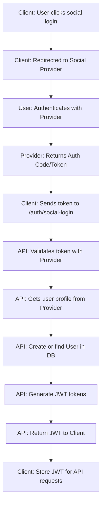
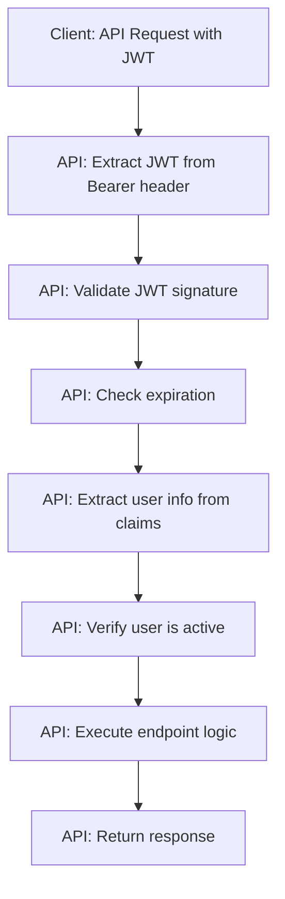
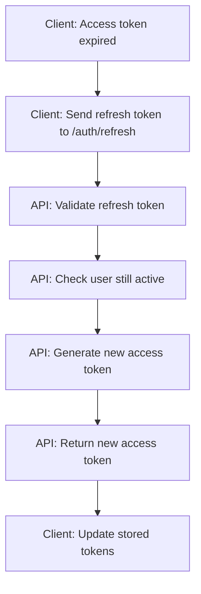

# JWT Authentication Flow and Token Structure

## JWT Token Structure

### JWT Payload Claims
```python
{
    # Standard Claims
    "sub": "user_id",           # Subject - User UUID as string
    "iat": 1640995200,          # Issued At - Unix timestamp
    "exp": 1640998800,          # Expiration - Unix timestamp
    "iss": "language-learning-api",  # Issuer
    "aud": "language-learning-app",  # Audience
    
    # Custom Claims
    "username": "john_doe",     # Username for easy access
    "email": "john@example.com", # Email for easy access
    "is_active": true,          # User account status
    "native_lang": "en",        # Native language code
    "study_lang": "es",         # Study language code
    "scopes": ["user", "study"] # User permissions/scopes
}
```

### Token Configuration
```python
# JWT Configuration
SECRET_KEY = "your-super-secret-key-here"  # From environment
ALGORITHM = "HS256"
ACCESS_TOKEN_EXPIRE_MINUTES = 60           # 1 hour
REFRESH_TOKEN_EXPIRE_DAYS = 30             # 30 days
ISSUER = "language-learning-api"
AUDIENCE = "language-learning-app"
```

## Authentication Flow

### 1. Social Login Flow



### 2. Protected Route Access


### 3. Token Refresh Flow


## JWT Implementation

### Token Generation
```python
from datetime import datetime, timedelta, timezone
import jwt
from typing import Dict, Any

class JWTManager:
    def __init__(self, secret_key: str, algorithm: str = "HS256"):
        self.secret_key = secret_key
        self.algorithm = algorithm
        self.issuer = "language-learning-api"
        self.audience = "language-learning-app"
    
    def create_access_token(
        self, 
        user: User, 
        expires_delta: timedelta | None = None
    ) -> str:
        """Create JWT access token for user"""
        if expires_delta:
            expire = datetime.now(timezone.utc) + expires_delta
        else:
            expire = datetime.now(timezone.utc) + timedelta(minutes=60)
        
        # Get user's language codes
        native_lang_code = user.native_language.code if user.native_language else None
        study_lang_code = user.study_language.code if user.study_language else None
        
        payload = {
            # Standard claims
            "sub": str(user.id),
            "iat": datetime.now(timezone.utc),
            "exp": expire,
            "iss": self.issuer,
            "aud": self.audience,
            
            # Custom claims
            "username": user.username,
            "email": user.email,
            "is_active": user.is_active,
            "native_lang": native_lang_code,
            "study_lang": study_lang_code,
            "scopes": ["user", "study"]  # Basic user permissions
        }
        
        return jwt.encode(payload, self.secret_key, algorithm=self.algorithm)
    
    def create_refresh_token(self, user: User) -> str:
        """Create JWT refresh token for user"""
        expire = datetime.now(timezone.utc) + timedelta(days=30)
        
        payload = {
            "sub": str(user.id),
            "iat": datetime.now(timezone.utc),
            "exp": expire,
            "iss": self.issuer,
            "aud": self.audience,
            "type": "refresh"  # Distinguish from access token
        }
        
        return jwt.encode(payload, self.secret_key, algorithm=self.algorithm)
    
    def verify_token(self, token: str) -> Dict[str, Any]:
        """Verify and decode JWT token"""
        try:
            payload = jwt.decode(
                token, 
                self.secret_key, 
                algorithms=[self.algorithm],
                audience=self.audience,
                issuer=self.issuer
            )
            return payload
        except jwt.ExpiredSignatureError:
            raise HTTPException(
                status_code=status.HTTP_401_UNAUTHORIZED,
                detail="Token has expired"
            )
        except jwt.InvalidTokenError:
            raise HTTPException(
                status_code=status.HTTP_401_UNAUTHORIZED,
                detail="Invalid token"
            )

# Global JWT manager instance
jwt_manager = JWTManager(
    secret_key=settings.JWT_SECRET_KEY,
    algorithm="HS256"
)
```

### Token Response Models
```python
from pydantic import BaseModel

class TokenResponse(BaseModel):
    """Response model for authentication endpoints"""
    access_token: str
    refresh_token: str
    token_type: str = "bearer"
    expires_in: int  # Seconds until access token expires
    user: UserPublic

class TokenRefreshResponse(BaseModel):
    """Response model for token refresh"""
    access_token: str
    token_type: str = "bearer"
    expires_in: int

class TokenData(BaseModel):
    """Token payload data for validation"""
    sub: str  # User ID
    username: str | None = None
    email: str | None = None
    is_active: bool = True
    scopes: list[str] = []
```

## FastAPI Security Dependencies

### OAuth2 Bearer Setup
```python
from fastapi.security import HTTPBearer, HTTPAuthorizationCredentials
from fastapi import Depends, HTTPException, status

# Security scheme for automatic OpenAPI documentation
security = HTTPBearer(
    scheme_name="JWT",
    description="Enter JWT token"
)

async def get_current_user(
    credentials: HTTPAuthorizationCredentials = Depends(security),
    session: SessionDep = Depends(get_session)
) -> User:
    """
    Dependency to get current authenticated user from JWT token
    """
    token = credentials.credentials
    
    # Verify token
    payload = jwt_manager.verify_token(token)
    
    # Extract user ID
    user_id = payload.get("sub")
    if not user_id:
        raise HTTPException(
            status_code=status.HTTP_401_UNAUTHORIZED,
            detail="Invalid token: no user ID"
        )
    
    # Get user from database
    try:
        user_uuid = uuid.UUID(user_id)
        user = session.get(User, user_uuid)
    except ValueError:
        raise HTTPException(
            status_code=status.HTTP_401_UNAUTHORIZED,
            detail="Invalid token: invalid user ID format"
        )
    
    if not user:
        raise HTTPException(
            status_code=status.HTTP_401_UNAUTHORIZED,
            detail="User not found"
        )
    
    if not user.is_active:
        raise HTTPException(
            status_code=status.HTTP_401_UNAUTHORIZED,
            detail="User account is inactive"
        )
    
    return user

async def get_current_active_user(
    current_user: User = Depends(get_current_user)
) -> User:
    """
    Dependency to get current active user (alias for clarity)
    """
    return current_user

# Optional: Dependency for getting user ID only (lighter weight)
async def get_current_user_id(
    credentials: HTTPAuthorizationCredentials = Depends(security)
) -> uuid.UUID:
    """
    Dependency to get current user ID without database lookup
    """
    token = credentials.credentials
    payload = jwt_manager.verify_token(token)
    
    user_id = payload.get("sub")
    if not user_id:
        raise HTTPException(
            status_code=status.HTTP_401_UNAUTHORIZED,
            detail="Invalid token: no user ID"
        )
    
    try:
        return uuid.UUID(user_id)
    except ValueError:
        raise HTTPException(
            status_code=status.HTTP_401_UNAUTHORIZED,
            detail="Invalid token: invalid user ID format"
        )
```

## Error Handling

### Authentication Errors
```python
class AuthenticationError(HTTPException):
    """Base authentication error"""
    def __init__(self, detail: str = "Authentication failed"):
        super().__init__(
            status_code=status.HTTP_401_UNAUTHORIZED,
            detail=detail,
            headers={"WWW-Authenticate": "Bearer"}
        )

class TokenExpiredError(AuthenticationError):
    """Token has expired"""
    def __init__(self):
        super().__init__("Token has expired")

class InvalidTokenError(AuthenticationError):
    """Token is invalid"""
    def __init__(self):
        super().__init__("Invalid authentication token")

class InactiveUserError(AuthenticationError):
    """User account is inactive"""
    def __init__(self):
        super().__init__("User account is inactive")
```

## Token Storage Strategy (Client Side)

### Recommended Client Implementation
```typescript
// Client-side token management (React Native example)
interface TokenStorage {
  accessToken: string;
  refreshToken: string;
  expiresAt: number;
}

class AuthService {
  private tokens: TokenStorage | null = null;
  
  async login(provider: string, socialToken: string): Promise<User> {
    const response = await fetch('/auth/social-login', {
      method: 'POST',
      headers: { 'Content-Type': 'application/json' },
      body: JSON.stringify({ provider, token: socialToken })
    });
    
    const data = await response.json();
    
    // Store tokens securely
    this.tokens = {
      accessToken: data.access_token,
      refreshToken: data.refresh_token,
      expiresAt: Date.now() + (data.expires_in * 1000)
    };
    
    // Store in secure storage
    await SecureStore.setItemAsync('auth_tokens', JSON.stringify(this.tokens));
    
    return data.user;
  }
  
  async getValidAccessToken(): Promise<string> {
    if (!this.tokens) {
      throw new Error('Not authenticated');
    }
    
    // Check if token is expired (with 5 minute buffer)
    if (Date.now() > (this.tokens.expiresAt - 300000)) {
      await this.refreshAccessToken();
    }
    
    return this.tokens.accessToken;
  }
  
  private async refreshAccessToken(): Promise<void> {
    // Implementation for token refresh
    // ...
  }
}
```

## Security Considerations

### Token Security
1. **Secret Key Management**: Use strong, randomly generated secret keys
2. **Token Expiration**: Short-lived access tokens (1 hour) with refresh tokens
3. **Secure Transmission**: Always use HTTPS
4. **Token Storage**: Store tokens securely on client (SecureStore, Keychain)
5. **Token Validation**: Always validate token signature and expiration

### Refresh Token Strategy
1. **Rotation**: Consider rotating refresh tokens on each use
2. **Revocation**: Implement token revocation for logout/security incidents
3. **Storage**: Refresh tokens should be stored more securely than access tokens
4. **Expiration**: Longer expiration (30 days) but still limited